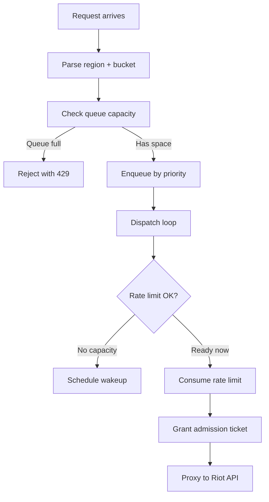

RiftRelay uses a sophisticated queueing system to manage incoming requests, ensure fair scheduling, and prevent rate limit violations.

## Admission Control Flow

When a request arrives, it goes through admission control before being proxied:



## Admission Request (internal/proxy/admission.go:34)

The admission middleware intercepts every request:

```go
func admissionMiddleware(l *limiter.Limiter, timeout time.Duration) {
    return func(next http.Handler) http.Handler {
        return http.HandlerFunc(func(w http.ResponseWriter, r *http.Request) {
            // 1. Extract region and bucket from path
            info := router.PathFromContext(r.Context())
            
            // 2. Check for X-Priority header
            priority := limiter.PriorityNormal
            if r.Header.Get("X-Priority") == "high" {
                priority = limiter.PriorityHigh
            }
            
            // 3. Request admission with timeout
            ctx, cancel := context.WithTimeout(r.Context(), timeout)
            defer cancel()
            
            ticket, err := l.Admit(ctx, limiter.Admission{
                Region:   info.Region,
                Bucket:   info.Bucket,
                Priority: priority,
            })
            
            // 4. Handle rejection or proceed
            if err != nil {
                w.Header().Set("Retry-After", ...)
                http.Error(w, "request rejected", 429)
                return
            }
            
            // 5. Proxy with assigned key index
            next.ServeHTTP(w, r.WithContext(withKeyIndex(ctx, ticket.KeyIndex)))
        })
    }
}
```

<Info>
  The admission timeout (configured via `ADMISSION_TIMEOUT`, default 5 minutes) is the **maximum time a request can wait in the queue**. After this, it's rejected with a timeout error.
</Info>

## Queue Structure

Each unique **bucket** (combination of region + endpoint pattern) has its own queue.

### Bucket Queue (internal/limiter/heap.go:8)

```go
type bucketQueue struct {
    region    string              // e.g., "na1"
    bucket    string              // e.g., "na1:lol/summoner/v4/summoners/by-name/{name}"
    high      []*admitRequest     // High-priority queue
    normal    []*admitRequest     // Normal-priority queue
    wakeAt    time.Time           // Next scheduled dispatch time
    heapIndex int                 // Position in wake heap
}
```

### Dual Priority Queues

Each bucket maintains **two FIFO queues**:

<CardGroup cols={2}>
  <Card title="High Priority" icon="bolt">
    For requests with `X-Priority: high` header. Bypasses pacing delays but still respects rate limits.
  </Card>
  
  <Card title="Normal Priority" icon="clock">
    Standard requests that use rate limit spreading for smooth traffic.
  </Card>
</CardGroup>

When dispatching, high-priority requests are **always dequeued first** (internal/limiter/heap.go:29):

```go
func (b *bucketQueue) dequeueValid() *admitRequest {
    // Try high priority first
    for len(b.high) > 0 {
        req := b.high[0]
        b.high = b.high[1:]
        if req.ctx.Err() == nil {  // Skip canceled/timed out
            return req
        }
    }
    
    // Fall back to normal priority
    for len(b.normal) > 0 {
        req := b.normal[0]
        b.normal = b.normal[1:]
        if req.ctx.Err() == nil {
            return req
        }
    }
    
    return nil
}
```

<Tip>
  Canceled or timed-out requests are automatically skipped during dequeue. This prevents wasted work on requests the client no longer cares about.
</Tip>

## Queue Capacity

The total number of requests that can be queued across **all buckets** is limited by `QUEUE_CAPACITY` (default 2048).

### Queue Depth Calculation (internal/limiter/heap.go:17)

```go
func (b *bucketQueue) depth() int {
    return len(b.high) + len(b.normal)
}
```

### Queue Full Rejection (internal/limiter/limiter.go:163)

When a bucket's queue reaches capacity:

```go
if bucket.depth() >= l.cfg.QueueCapacity {
    // Pick the best key to estimate when capacity will be available
    _, earliest := l.pickKey(now, keys, bucket.region, bucket.bucket, priority)
    
    // Reject with calculated retry time
    return admitResponse{
        err: &RejectedError{
            Reason:     "queue_full",
            RetryAfter: max(earliest.Sub(now), time.Second),
        },
    }
}
```

<Warning>
  When the queue is full, RiftRelay rejects new requests immediately with **429 Too Many Requests** and a `Retry-After` header. The retry time is based on when the rate limiter expects capacity to be available.
</Warning>

## Admission Timeout

Requests wait in the queue until:

1. **Admitted**: Rate limit capacity is available
2. **Timeout**: `ADMISSION_TIMEOUT` expires (default 5 minutes)
3. **Canceled**: Client disconnects or request context is canceled

The admission timeout is enforced at the middleware level (internal/proxy/admission.go:54):

```go
admitCtx, cancel := context.WithTimeout(r.Context(), timeout)
defer cancel()

ticket, err := l.Admit(admitCtx, admission)
if err != nil {
    // Could be context.DeadlineExceeded (timeout)
    // or context.Canceled (client disconnect)
    // or RejectedError (queue full, no key, etc.)
}
```

## Dispatch Loop

The limiter runs a single-threaded event loop that processes admission requests, observations, and timer events (internal/limiter/limiter.go:84).

### Event Loop (internal/limiter/limiter.go:98)

```go
func (l *Limiter) loop() {
    keys := make([]keyState, l.cfg.KeyCount)
    buckets := make(map[string]*bucketQueue)
    wakeups := make(wakeHeap, 0)  // Min-heap by wakeAt time
    timer := time.NewTimer(idleTimerWindow)
    
    for {
        // Calculate next wake time from heap
        nextWake := idleTimerWindow
        if len(wakeups) > 0 {
            nextWake = wakeups[0].wakeAt.Sub(now)
        }
        resetTimer(timer, nextWake)
        
        select {
        case req := <-l.admitCh:
            l.handleAdmit(req, keys, buckets, &wakeups)
            
        case obs := <-l.observeCh:
            l.handleObservation(obs, keys, buckets, &wakeups)
            
        case <-timer.C:
            // Dispatch all buckets that are ready
            for wakeups[0].wakeAt <= now {
                bucket := heap.Pop(&wakeups)
                l.dispatch(bucket, keys, &wakeups)
            }
            
        case done := <-l.closeCh:
            // Reject all queued requests and exit
            for _, bucket := range buckets {
                for req := bucket.dequeueValid(); req != nil; ... {
                    req.resp <- admitResponse{err: &RejectedError{Reason: "shutting_down"}}
                }
            }
            close(done)
            return
        }
    }
}
```

### Handling Admission Requests (internal/limiter/limiter.go:139)

When an admission request arrives:

```go
func (l *Limiter) handleAdmit(req *admitRequest, keys []keyState, buckets map[string]*bucketQueue, wakeups *wakeHeap) {
    // 1. Get or create bucket
    bucket := buckets[req.admission.Bucket]
    if bucket == nil {
        bucket = &bucketQueue{
            region:    req.admission.Region,
            bucket:    req.admission.Bucket,
            heapIndex: -1,
        }
        buckets[req.admission.Bucket] = bucket
    }
    
    // 2. Check capacity
    if bucket.depth() >= l.cfg.QueueCapacity {
        // Reject immediately
    }
    
    // 3. Enqueue
    bucket.enqueue(req)
    
    // 4. Try to dispatch immediately
    l.dispatch(bucket, keys, wakeups)
}
```

### Dispatching Requests (internal/limiter/limiter.go:221)

The dispatch function tries to admit queued requests:

```go
func (l *Limiter) dispatch(bucket *bucketQueue, keys []keyState, wakeups *wakeHeap) {
    for {
        // 1. Dequeue next valid request (high priority first)
        req := bucket.dequeueValid()
        if req == nil {
            removeWake(wakeups, bucket)  // No more requests
            return
        }
        
        // 2. Pick the best key
        keyIndex, earliest := l.pickKey(now, keys, bucket.region, bucket.bucket, req.admission.Priority)
        if keyIndex < 0 {
            // No key available at all
            req.resp <- admitResponse{err: &RejectedError{Reason: "no_available_key"}}
            continue
        }
        
        // 3. Check if ready now
        if earliest.After(now) {
            // Not ready yet - put request back and schedule wakeup
            bucket.enqueue(req)  // Back to front of queue
            upsertWake(wakeups, bucket, earliest)
            return
        }
        
        // 4. Try to consume rate limit
        key := &keys[keyIndex]
        if !key.app(region).consume(now) || !key.method(bucket).consume(now) {
            // Race condition or rounding error - retry soon
            bucket.enqueue(req)
            upsertWake(wakeups, bucket, now.Add(5*time.Millisecond))
            return
        }
        
        // 5. Grant admission!
        req.resp <- admitResponse{ticket: Ticket{KeyIndex: keyIndex}}
        // Continue to next request in queue
    }
}
```

<Info>
  The dispatch loop processes **all ready requests** in a bucket before moving to the next event. This maximizes throughput when multiple requests can be admitted at once.
</Info>

## Wake Heap

Buckets that can't be dispatched immediately are scheduled for future dispatch using a **min-heap** (internal/limiter/heap.go:51).

```go
type wakeHeap []*bucketQueue

func (h wakeHeap) Less(i, j int) bool {
    return h[i].wakeAt.Before(h[j].wakeAt)
}
```

The heap maintains buckets ordered by `wakeAt` time, so the event loop knows when to wake up next.

### Upsert Wake (internal/limiter/heap.go:79)

```go
func upsertWake(h *wakeHeap, bucket *bucketQueue, at time.Time) {
    bucket.wakeAt = at
    if bucket.heapIndex >= 0 {
        // Already in heap - update position
        heap.Fix(h, bucket.heapIndex)
    } else {
        // Not in heap - insert
        heap.Push(h, bucket)
    }
}
```

This allows efficient scheduling: O(log n) to insert or update a bucket's wake time.

## Rejection Reasons

Requests can be rejected for several reasons (internal/limiter/types.go:52):

<AccordionGroup>
  <Accordion title="queue_full">
    The bucket's queue has reached `QUEUE_CAPACITY`. The client should back off and retry after the suggested `Retry-After` time.
    
    See internal/limiter/limiter.go:167.
  </Accordion>
  
  <Accordion title="no_available_key">
    None of the configured API keys can handle the request (e.g., all keys are rate-limited). This is rare with proper configuration.
    
    See internal/limiter/limiter.go:236.
  </Accordion>
  
  <Accordion title="shutting_down">
    RiftRelay is shutting down and draining the queue. The request should be retried against a different instance or after restart.
    
    See internal/limiter/limiter.go:128.
  </Accordion>
  
  <Accordion title="invalid_route">
    The request path couldn't be parsed (missing region or upstream path). This indicates a client error.
    
    See internal/limiter/limiter.go:45.
  </Accordion>
</AccordionGroup>

All rejections return `RejectedError` with a `Reason` and optional `RetryAfter` duration:

```go
type RejectedError struct {
    Reason     string
    RetryAfter time.Duration
}
```

## Metrics

When metrics are enabled (`ENABLE_METRICS=true`), the queue system exposes:

- **Queue depth** by bucket and priority (internal/limiter/limiter.go:179)
- **Admission wait time** (how long requests wait in queue)
- **Admission outcomes**: `allowed`, `rejected_queue_full`, `rejected_no_key`

Example Prometheus metrics:

```
riftrelay_queue_depth{bucket="na1:lol/summoner/v4/summoners/by-name/{name}",priority="normal"} 15
riftrelay_admission_wait_seconds_bucket{le="0.1"} 42
riftrelay_admission_total{outcome="allowed"} 1523
riftrelay_admission_total{outcome="rejected_queue_full"} 7
```

## Graceful Shutdown

When RiftRelay receives SIGINT or SIGTERM (main.go:24):

1. The HTTP server stops accepting new connections
2. Existing requests in the admission queue complete or time out within `SHUTDOWN_TIMEOUT`
3. After the timeout, remaining queued requests are rejected with `shutting_down` (internal/limiter/limiter.go:124)

```go
case done := <-l.closeCh:
    for _, bucket := range buckets {
        for req := bucket.dequeueValid(); req != nil; req = bucket.dequeueValid() {
            select {
            case req.resp <- admitResponse{err: &RejectedError{Reason: "shutting_down"}}:
            default:
            }
        }
    }
    close(done)
    return
```

<Warning>
  Set `SHUTDOWN_TIMEOUT` high enough to allow normal traffic to drain. The default is 20 seconds, which may not be sufficient for heavily queued workloads.
</Warning>

## Best Practices

<Steps>
  <Step title="Configure appropriate queue capacity">
    Set `QUEUE_CAPACITY` based on expected burst traffic. Default is 2048, which works for most use cases. If you see frequent `queue_full` rejections, increase this value.
  </Step>
  
  <Step title="Use high priority sparingly">
    The `X-Priority: high` header bypasses pacing but can cause bursty traffic. Reserve it for time-sensitive requests like game events.
  </Step>
  
  <Step title="Set realistic admission timeouts">
    The default `ADMISSION_TIMEOUT` of 5 minutes is generous. For interactive use cases, consider lowering it to fail fast instead of queuing for extended periods.
  </Step>
  
  <Step title="Monitor queue depth metrics">
    If queue depth consistently grows, you may need more API keys or need to reduce request rate upstream.
  </Step>
</Steps>

## Next Steps

<Card title="Rate Limiting" icon="gauge" href="/architecture/rate-limiting">
  Learn how rate limits are tracked and enforced
</Card>